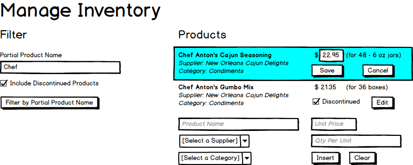

# West-Wind Wholesale - Design

The database design for ***West-Wind Wholesale*** is represented in the following ERD. There are [additional](./Images/ReadMe.md) + [images](./Images/Marketing/ReadMe.md) for use in the demos.

## Maintaining the Product Catalog

The Product Catalog can be laid out in various ways. The following mockup represents products organized by category.

Product information can be maintained via a form that looks like this. This form has a search component to filter the list of products, as well as a form for adding a new product.

In quick-edit mode, the form could look like this. Note that the only editable item is the Price.

## Sales

The following sequence diagram illustrates the Sales process.

