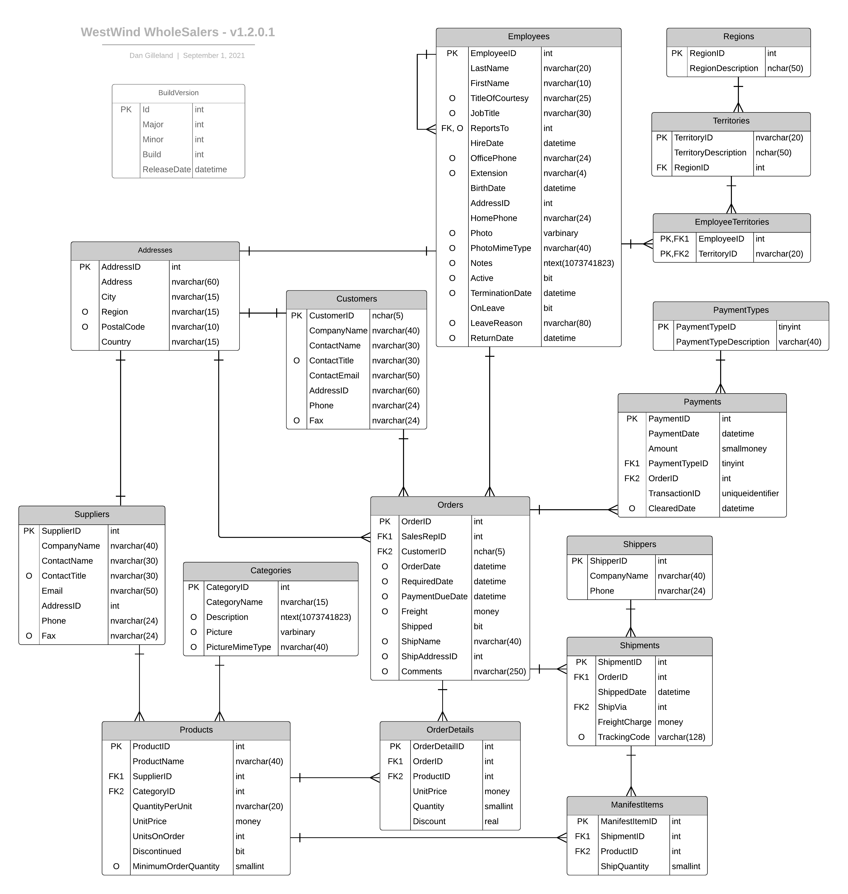

# West-Wind Wholesale - Design

The database design for ***West-Wind Wholesale*** is represented in the following ERD.



## Maintaining the Product Catalog

The following class can be used for a CRUD-styled approach to maintaining the items in the product catalog. This single POCO can be used with a `ListView` or `GridView` bound to an `ObjectDataSource`. The BLL class can expose the CRUD functionality alongside the `[DataObject]` and related attributes.

```csharp
public class ProductItem
{
    public int ProductId { get; set; }
    public string Name { get; set; }
    public int SupplierId { get; set; }
    public int CategoryId { get; set; }
    public string Suppier { get; set; }
    public string Category { get; set; }
    public decimal SuggestedUnitPrice { get; set; }
    public string QuantityPerUnit { get; set; }
}
```

