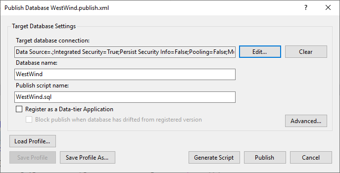
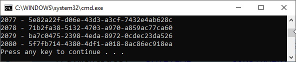

# WestWind Wholesale

> Derived from the original *Northwind Traders*, this demo database maintains much of the original but includes additions/changes that allow the business to be imagined as a drop-shipping wholesaler. Also, dates have been bumped up by 20 years, to make it look a bit more "modern".

----

## Building on your Own

To regenerate the database from the source files and generate random shipment/payment information:

1. Open the Visual Studio solution in the `\src` folder.
1. Publish the database using `WestWind.publish.xml`.

